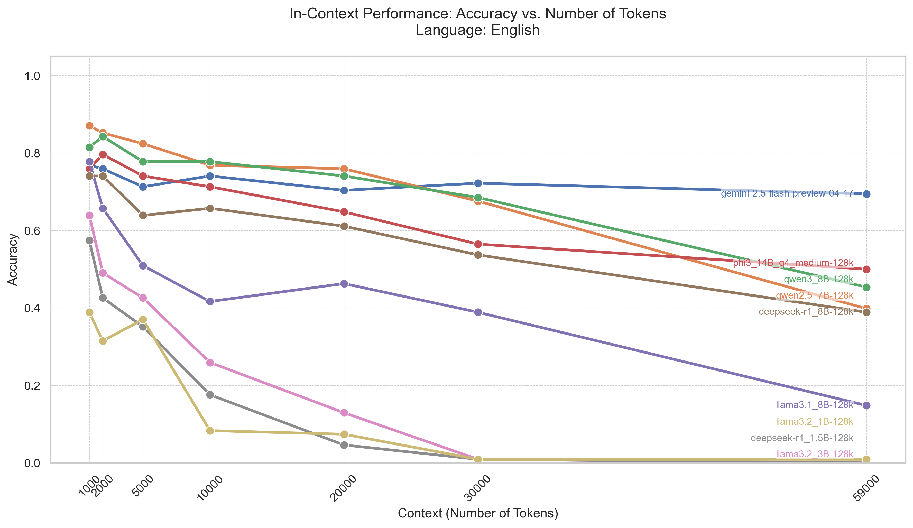

      
# *Agri-Query*: A CASE STUDY ON RAG VS. LONG-CONTEXT LLMS FOR CROSS-LINGUAL TECHNICAL QUESTION ANSWERING

## Contents

This main README serves as a central navigation point. Please refer to the specific README files and results folders within each project directory for detailed information, setup instructions, and findings.

*   **RAG (Retrieval-Augmented Generation):**
    *   **Project Details:** [RAG README](RAG/README.md)
    *   **RAG Evaluation:** [RAG Evaluation](RAG)
    *   **RAG Results:** [RAG Results Folder](RAG/results/) 
    *(Note: Please ensure a `README.md` and a `results` folder exist within the `RAG` directory for these links to work correctly. Adjust the results folder path if it's named differently).*

## Long Context Evaluation (Referred to as "Zeroshot" in Codebase)

This evaluation assesses the capability of Large Language Models (LLMs) to answer questions when provided with extensive context. The tests are conducted without any model fine-tuning, focusing on the LLMs' inherent ability to process and retrieve information from varying lengths of text.

**Key Aspects of this Evaluation:**

*   **Guaranteed Answer Presence:** For each question, the context supplied to the LLM always contains the page with the correct answer. This setup tests the model's ability to locate information within the provided text, rather than its ability to recall information from prior training.
*   **Variable Context Lengths with "Noise":** To simulate challenges of finding relevant information in large documents, tests are run with different context sizes. This includes scenarios where "noise" – additional, potentially irrelevant pages – is appended to the core context. For example, tests might involve adding 10k tokens of noise or using the entire document (approximately 59k tokens) as context.
*   **Performance Metrics:** Model performance is measured using standard information retrieval metrics, including accuracy, precision, recall, and F1-score.

**Codebase and Tools:**

*   **"Zeroshot" Terminology:** In this project's codebase, evaluations of this nature are referred to as "Zeroshot." The `Zeroshot/` directory contains all relevant scripts and utilities for conducting these long context evaluations.
*   **PDF to Text Conversion:** To prepare PDF documents for this framework (specifically, converting them into a page-wise plain text format suitable for ingestion), use the `docling_page_wise_pdf_converter` tool. This tool is located in the `zeroshot/docling_page_wise_pdf_converter/` directory.

**Example Visualization:**
The following image illustrates how the results from long context evaluations are typically visualized, showing accuracy against varying levels of noise:

Long context Accuracy comparison for English manual

*   **ZeroShot Evaluation:**
    *   **Project Details:** [ZeroShot README](ZeroShot/README.md)
    *   **Results:** [ZeroShot Results Folder](ZeroShot/results/)
    *   **Visualizations:** [ZeroShot Visualization Plots](ZeroShot/results/visualization/plots/)

---

*This README provides navigation. For specific project details and outcomes, please consult the files and folders linked above.*